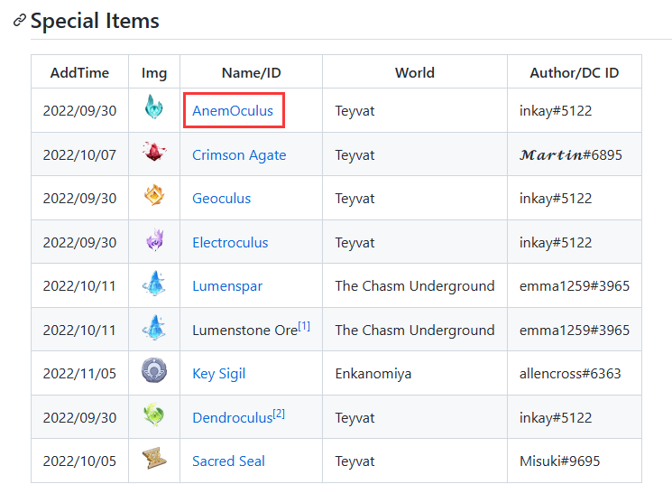
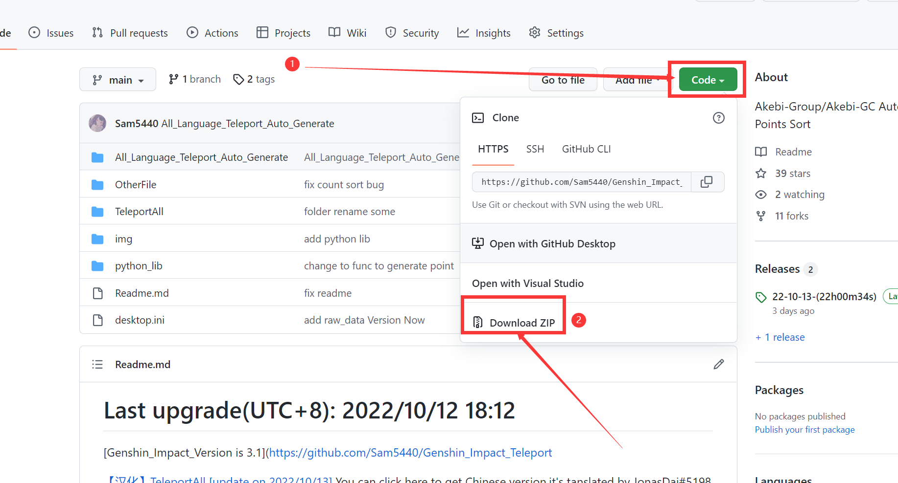
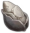
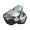
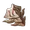
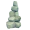

  
   
  
   
  
  
   
  

    
    </img>
  

  If it's helpful to you,please give us a <b>Star</b>!

---

We develop the quickest 3D route navigation map for Genshin Impact as a player-friendly project, cutting down on time-wasting repeated routes and improving the efficiency of your gaming experience.

> **Note:** We only provide the raw data. You may need to use other tools, such as map generation or image recognition.

---

**2023/01/27 Last Update**

>

> **Update Log**
>
> Now, you can download each directory as a separate zip file. Just click it --> [Genshin_Impact_Teleport/download](https://github.com/Sam5440/Genshin_Impact_Teleport/tree/download)

---
> The current 3.4 points have yet to be announced. The expected announcement time is mid-February.
>
> Incidentally, Mihoyo has changed the data for 3.4, and there will be discrepancies with the data I have. The data added for 3.4 may need to be included, and you will need to refine it yourself.
>

- [Disclaimer](#disclaimer)
- [**How to download?**](#how-to-download)
  - [Download sorted files](#download-sorted-files)
  - [Download the entire repository](#download-the-entire-repository)
  - [Download each directory as a zip file](#download-each-directory-as-a-zip-file)
  - [How to search in web page?](#how-to-search-in-web-page)
- [**ManualCollectPoint**](#manualcollectpoint)
  - [Special Items](#special-items)
  - [Local Specialties](#local-specialties)
  - [Inventory](#inventory)
  - [Chunks](#chunks)
  - [Monsters](#monsters)
  - [Chest](#chest)
  - [ExploreTo100](#exploreto100)
  - [OtherPoint](#otherpoint)
- [**ManualOptimizationPoint**](#manualoptimizationpoint)
  - [\[Old\] TeleportsALL(Version\_2.8)](#old-teleportsallversion_28)
  - [\[Chinese\]ManualCollectPoint(2022-10-13)](#chinesemanualcollectpoint2022-10-13)
  - [\[Chinese\]SDK-China Optimized](#chinesesdk-china-optimized)
  - [SleepJson](#sleepjson)
  - [Auto-Teleport\_byA9FM(26\_01\_2023)](#auto-teleport_bya9fm26_01_2023)
- [**AutoGeneratePoint**](#autogeneratepoint)
  - [Teleport ALL\[v3.4\]](#teleport-allv34)
  - [ALL Waypoint](#all-waypoint)
  - [3.3 Dendroculus 180](#33-dendroculus-180)
- [Data From](#data-from)
- [Thanks](#thanks)
- [About Issues And PR](#about-issues-and-pr)
  - [Star History](#star-history)

# Disclaimer

> **This tutorial provides in-game coordinates guidance for users of AS, NA, and EU platforms to help you experience the game more happily.**
> 
> **You can use this data to quickly generate the 3D map info you need in the visualization tool.**
>
> **This project should not be used for commercial purposes, only for learning and communication.**
>
> **Ce projet n'est pas destiné à un usage commercial et est uniquement destiné à l'apprentissage et à l'échange.**
>
> **このプロジェクトは営利目的ではなく、学習と交流のためにのみ使用されます。**
>
> **Dieses Projekt ist nicht für den kommerziellen Gebrauch bestimmt und dient ausschließlich dem Lernen und dem Austausch.**
>
> **本项目不得用于商业用途，仅做学习交流。**

---

# How to download?

## Download sorted files

> 
>
> **We Linked some of ID connect to the download link.**
>
> **Now you just need to click the hyperlink and select it again on the new web to download it if it has been linked**

## Download the entire repository

> 
>
> **If you are unable to download successfully, please download the separately compressed package file (release, On the right side), even though it may not be the latest**
>
> **If you use git, maybe you will meet** `Filename too long`.
>
> **only press** `git config --global core.longpaths true` **to solve it.**

## Download each directory as a zip file

[Click me](https://github.com/Sam5440/Genshin_Impact_Teleport/tree/download) and look for the files you need in the same directory.

Download Branch : [Sam5440/Genshin_Impact_Teleport at download](https://github.com/Sam5440/Genshin_Impact_Teleport/tree/download)

## How to search in web page?

**method 1:**

>Press "Ctrl+F" and do your search.
>
>Tips: search the text without "-" to improve accuracy.
>
>For example, search "sweet" or "flower" instead of "sweet-flower."
>
>It cannot search for the name of the folder

**method 2:**

> Open the folder directly to view it. It's categorized for easier searching.

# ManualCollectPoint

>These are the **highly accurate** coordinates recorded by the player,partly from Discord.
>But **only some of the coordinates**.

## Special Items

| AddTime    | Img                                                   | Name/ID               | World                 | Author/DC ID  |
| ---------- | ----------------------------------------------------- | --------------------- | --------------------- | ------------- |
| 2022/09/30 |      | [AnemOculus](https://github.com/Sam5440/Genshin_Impact_Teleport/tree/download/ManualCollectPoint/SpecialItems#anemoculuszip)            | Teyvat                | inkay#5122    |
| 2022/10/07 |  | [Crimson Agate](https://github.com/Sam5440/Genshin_Impact_Teleport/tree/download/ManualCollectPoint/SpecialItems#crimson-agatezip)         | Teyvat                | 𝓜𝓪𝓻𝓽𝓲𝓷#6895  |
| 2022/09/30 |          | [Geoculus](https://github.com/Sam5440/Genshin_Impact_Teleport/tree/download/ManualCollectPoint/SpecialItems#geoculuszip)              | Teyvat                | inkay#5122    |
| 2022/09/30 |  | [Electroculus](https://github.com/Sam5440/Genshin_Impact_Teleport/tree/download/ManualCollectPoint/SpecialItems#electroculuszip)          | Teyvat                | inkay#5122    |
| 2022/10/11 |        | [Lumenspar](https://github.com/Sam5440/Genshin_Impact_Teleport/tree/download/ManualCollectPoint/SpecialItems#lumensparzip)             | The Chasm Underground | emma1259#3965 |
| 2022/10/11 |        | [Lumenstone Ore](https://github.com/Sam5440/Genshin_Impact_Teleport/tree/download/ManualCollectPoint/SpecialItems#lumenspar-upgradezip)[^1] | The Chasm Underground | emma1259#3965 |
| 2022/11/05 |       | [Key Sigil](https://github.com/Sam5440/Genshin_Impact_Teleport/tree/download/ManualCollectPoint/SpecialItems#key-sigilzip)             | Enkanomiya            | allencross#6363|
| 2022/09/30 |    | [Dendroculus](https://github.com/Sam5440/Genshin_Impact_Teleport/tree/download/ManualCollectPoint/SpecialItems#dendroculuszip)[^2]       | Teyvat                | inkay#5122    |
| 2023/01/19 |    | [Dendroculus 3.4](https://github.com/Sam5440/Genshin_Impact_Teleport/tree/download/ManualCollectPoint/SpecialItems/Dendroculus#34zip)[^3]       | Teyvat                | 空白#0099 |
| 2022/10/05 |      | [Sacred Seal](https://github.com/Sam5440/Genshin_Impact_Teleport/tree/download/ManualCollectPoint/SpecialItems#sacred-sealzip)           | Teyvat                | Misuki#9695   |
| 2023/01/19 |      | [Sacred Seal 3.4](https://github.com/Sam5440/Genshin_Impact_Teleport/tree/download/ManualCollectPoint/SpecialItems/Sacred%20Seal#34zip)           | Teyvat                | 空白#0099 |

## Local Specialties

| AddTime    | Img                                                | Name/ID             | World  | Author/ID         | NOTE         |
| ---------- | -------------------------------------------------- | ------------------- | ------ | ----------------- | -------------|
| 2023/01/24  | | [Sand Grease Pupa](https://github.com/Sam5440/Genshin_Impact_Teleport/tree/download/ManualCollectPoint/LocalSpecialties#sandgreasepupazip) | Teyvat | [Drich#6666](https://github.com/Drich3614) | 74 Pupae |
| 2022/10/07 |  | [scarab](https://github.com/Sam5440/Genshin_Impact_Teleport/tree/download/ManualCollectPoint/LocalSpecialties#teyvat-scarabzip) | Teyvat | ShinaKaria#9760 | 72 pcs |
| 2022/10/12 |  | [scarab#2](https://github.com/Sam5440/Genshin_Impact_Teleport/tree/download/ManualCollectPoint/LocalSpecialties#teyvat-scarab2zip) | Teyvat | civicmanan#2171 | 74 pcs |
| 2023/01/26 |  | [Silk Flower](https://github.com/Sam5440/Genshin_Impact_Teleport/tree/download/ManualCollectPoint/LocalSpecialties#silkflowerzip) | Teyvat | [Drich#6666](https://github.com/Drich3614) | 28 Flowers |

## Inventory

| AddTime    | Img                                               | Name/ID    | World  | Author/ID       | NOTE |
| ---------- | ------------------------------------------------- | ---------- | ------ | --------------- | ---- |
| 2022/10/07 | | [CrystalCore_12point](https://github.com/Sam5440/Genshin_Impact_Teleport/tree/download/ManualCollectPoint/Inventory#crystalcore_12pointzip) | Teyvat | Linxia#0961              | 12 point     |
| 2022/10/15 | | [CrystalCore_35point](https://github.com/Sam5440/Genshin_Impact_Teleport/tree/download/ManualCollectPoint/Inventory#crystalcore_35pointzip) | Teyvat | Chongdong#4545 | 2022/10/07's CrystalCore_12point update version. |

## Chunks

| AddTime    | Img                                                          | Name/ID                                                      | World                                     | Author/ID                        | NOTE                                                         |
| ---------- | ------------------------------------------------------------ | ------------------------------------------------------------ | ----------------------------------------- | -------------------------------- | ------------------------------------------------------------ |
| 2022/10/11 |  | [72Enrichment points](https://github.com/Sam5440/Genshin_Impact_Teleport/tree/download/ManualCollectPoint/Chunk#72enrichmentpointszip) | Teyvat(1-38)/The Chasm Underground(38-72) | jdbddbhd#9874                    | 72 mineral enrichment points, including Inazuma,maybe you need to move to pick/destory them.And points after 38 are in The Chasm Underground |
| 2022/10/07 |         | [CrystalChunk](https://github.com/Sam5440/Genshin_Impact_Teleport/tree/download/ManualCollectPoint/Chunk#crystalchunkzip) | Teyvat                                    | Michell Lim#9331 and Linxia#0961 | /                                                            |
| 2022/10/07 |         | [CrystalChunk-The Chasm Underground](https://github.com/Sam5440/Genshin_Impact_Teleport/tree/download/ManualCollectPoint/Chunk#crystalchunk-the-chasm-undergroundzip) | The Chasm Underground                     | Michell Lim#9331 and Linxia#0961 | CrystalChunk-19 to 43 are in The Chasm Underground.          |
| 2022/10/11 |         | [EnkanomiyaAmethystLump](https://github.com/Sam5440/Genshin_Impact_Teleport/tree/download/ManualCollectPoint/Chunk#enkanomiyaamethystlumpzip) | Enkanomiya                                | Michell Lim#9331                 | /                                                            |
| 2022/10/11 |         | [AmethystLump](https://github.com/Sam5440/Genshin_Impact_Teleport/tree/download/ManualCollectPoint/Chunk#amethystlumpzip) | Teyvat                                    | Michell Lim#9331                 | /                                                            |

## Monsters

(Outdated)Points below are only upgraded up to version 2.8.

| AddTime    | Img                                                          | Name/ID          | World  | Author/ID        | NOTE                                                         |
| ---------- | ------------------------------------------------------------ | ---------------- | ------ | ---------------- | ------------------------------------------------------------ |
| 2022/10/11 |  | [Unusual Hilichurl](https://github.com/Sam5440/Genshin_Impact_Teleport/tree/download/ManualCollectPoint/Monster#unusualhilichurlzip) | Teyvat | jdbddbhd#9874    | /                                                            |
| 2022/10/11 |             | [Fatui Agent](https://github.com/Sam5440/Genshin_Impact_Teleport/tree/download/ManualCollectPoint/Monster#fatuiagentzip)       | Teyvat | Michell Lim#9331 | /        |
| 2022/12/22 |             | [Fatui Agent 22](https://github.com/Sam5440/Genshin_Impact_Teleport/tree/download/ManualCollectPoint/Monster#fatuiagent22zip)       | Teyvat | Unknow | /                                                          |
| 2022/10/12 |                       | [Slime](https://github.com/Sam5440/Genshin_Impact_Teleport/tree/download/ManualCollectPoint/Monster#slimezip)            | Teyvat | Foxx#0061        | Sorted by different color/properties.(ver2.8)             |
| 2022/10/12 |                   | [Specter](https://github.com/Sam5440/Genshin_Impact_Teleport/tree/download/ManualCollectPoint/Monster#specterzip)          | Teyvat | Foxx#0061        | Sorted by different color/properties.(ver2.8)             |
| 2022/10/12 |  | [Rifthound](https://github.com/Sam5440/Genshin_Impact_Teleport/tree/download/ManualCollectPoint/Monster#rifthoundzip)        | Teyvat | Foxx#0061        | Sorted by different color/properties.(ver2.8)             |
| 2022/10/12 |  | [Fatui Elite](https://github.com/Sam5440/Genshin_Impact_Teleport/tree/download/ManualCollectPoint/Monster#fatuielitezip)       | Teyvat | Foxx#0061        | Sorted by different kind.(ver2.8)                         |
| 2022/10/12 |   | [Fatui Skirmisher](https://github.com/Sam5440/Genshin_Impact_Teleport/tree/download/ManualCollectPoint/Monster#fatuiskirmisherzip)  | Teyvat | Foxx#0061        | Sorted by different color/properties.(ver2.8)             |
| 2022/10/12 |  | [Nobushi&Kairagi](https://github.com/Sam5440/Genshin_Impact_Teleport/tree/download/ManualCollectPoint/Monster#nobushikairagizip)  | Teyvat | Foxx#0061        | Sorted by different kinds.(ver2.8)                        |
| 2022/10/12 |       | [Whopperflower](https://github.com/Sam5440/Genshin_Impact_Teleport/tree/download/ManualCollectPoint/Monster#whopperflowerzip)    | Teyvat | Foxx#0061        | Sorted by different color/properties,and**you should press "F" to find the WhopperFlower which is hiding  in the flowers**.(ver2.8) |
| 2022/10/12 |   | [Treasure Hoarders](https://github.com/Sam5440/Genshin_Impact_Teleport/tree/download/ManualCollectPoint/Monster#treasurehoarderszip) | Teyvat | Foxx#0061        | Sorted by different kinds.(ver2.8)                        |
| 2022/10/18 |                       | [Fungi](https://github.com/Sam5440/Genshin_Impact_Teleport/tree/download/ManualCollectPoint/Monster#fungizip)            | Teyvat | sam5440 | fungal-spores,11 pcs point                                   |
| 2023/01/27 |  | [ConsecratedBeast](https://github.com/Sam5440/Genshin_Impact_Teleport/tree/download/ManualCollectPoint/Monster#consecratedBeastzip) | Teyvat | Noxbur#8330 | /                                                            |
| 2023/01/28 |  | [Nobushi&Kairagi-2](https://github.com/Sam5440/Genshin_Impact_Teleport/tree/download/ManualCollectPoint/Monster#nobushikairagizip-2) | Teyvat | 6-716#1245 | 6-716#1245 Manually screened efficient points |
| 2023/01/28 |  | [Specter-2](https://github.com/Sam5440/Genshin_Impact_Teleport/tree/download/ManualCollectPoint/Monster#specter-2zip) | Teyvat | 6-716#1245 | 6-716#1245 Manually screened efficient points |
| 2023/01/28 |  | [Black Serpent Knight](https://github.com/Sam5440/Genshin_Impact_Teleport/tree/download/ManualCollectPoint/Monster#blackserpentknightzip) | The Chasm Underground | 6-716#1245 | 6-716#1245 Manually screened efficient points |
| 2023/01/28 | ...... | [Ruin Machines](https://github.com/Sam5440/Genshin_Impact_Teleport/tree/download/ManualCollectPoint/Monster#ruinmachineszip) | Teyvat | 6-716#1245 | 6-716#1245 Manually screened efficient points |

## Chest

| AddTime    | Name                                                         | Floder Name/ID                                               | World  | Author/ID        | NOTE                                                         |
| ---------- | ------------------------------------------------------------ | ------------------------------------------------------------ | ------ | ---------------- | ------------------------------------------------------------ |
| 2022/10/13 | Ver3.1 RockPileSemeru | [Ver3.1 RockPileSemeru](https://github.com/Sam5440/Genshin_Impact_Teleport/tree/download/ManualCollectPoint/Chest#ver31-rockpilesemeruzip) | Teyvat | Michell Lim#9331 | Some of them are inside the sand pile and need to be cleared by wind elements, another one is to break the bottle, and 2 are to break the rock |
| 2022/12/22 | Liyue  - 1043 chest | [Liyue Chests Json 1043](https://github.com/Sam5440/Genshin_Impact_Teleport/tree/download/ManualCollectPoint/Chest#liyue-chests-json-1043zip) | Teyvat | ꧁༺ꜱɑ¡ζɑლɑ༻꧂#1264 | all Liyue chest.num:1043                                     |
| 2023/01/10 | Generate Chest | [Generate Chest](https://github.com/Sam5440/Genshin_Impact_Teleport/tree/download/ManualCollectPoint/Chest#generate-chestzip) | ALL    | lithtech#9980    | Only the treasure chest location JSON exists, no starting point for solving the treasure chest in the puzzle category |
| 2023/01/20 | Ver3.4 Chest | [Ver3.4 Chest](https://github.com/Sam5440/Genshin_Impact_Teleport/tree/download/ManualCollectPoint/Chest#ver34-chestzip) | Teyvat | 空白#0099 | All chest in ver 3.4's new area ,include (RockPileSemeru),but Some need to Decrypt . |

## ExploreTo100

| AddTime | Name | Floder Name/ID | World | Author/ID | NOTE |
| ------------- | ------------------------------------------------------------ | ----------------------------- | ------------ | ----------------- | ------------------------------------------------------------ |
| 2022/11/04    | Sumeru Desert - 100% | [Sumeru_Desert_100](https://github.com/Sam5440/Genshin_Impact_Teleport/tree/download/ManualCollectPoint/ExploreTo100#sumeru_desert_100zip)             | Teyvat       | zxcreepz#0001     | Sumeru Desert - 100% region - all chests, sacred seals and dendroculus |
| 2022/11/04    | Sumeru  - 100% | [Sumeru_Region_100](https://github.com/Sam5440/Genshin_Impact_Teleport/tree/download/ManualCollectPoint/ExploreTo100#sumeru_region_100zip)           | Teyvat       | zxcreepz#0001     | Sumeru  100% region - all chests, sacred seals and dendroculus |
| 2023/01/10    | TheChasm100% | [The Chasm 100%](https://github.com/Sam5440/Genshin_Impact_Teleport/tree/download/ManualCollectPoint/ExploreTo100#thechasm100zip)                | Thechasm100% | serendipity#3437  | The Chasm 100%                                               |
| 2023/01/10    | The Chasm UndergroundMines 100% | [TheChasmUndergroundMines 100%](https://github.com/Sam5440/Genshin_Impact_Teleport/tree/download/ManualCollectPoint/ExploreTo100#thechasmundergroundmines100zip) | The chasm    | serendipity#3437  | The Chasm UndergroundMines 100%                              |

## OtherPoint

Not coordinates. Some of the files needed are pictures etc.

| AddTime    | Name                                                          | Floder Name/ID                   | World  | Author/ID        | NOTE                                                         |
| ---------- | ------------------------------------------------------------ | ------------------------- | ------ | ---------------- | ------------------------------------------------------------ |
| 2022/10/07 | artifact farm-圣遗物狗粮[dogfood] | [gouliangv2](https://github.com/Sam5440/Genshin_Impact_Teleport/tree/download/ManualCollectPoint/OtherPoint#gouliangv2zip)                | Teyvat | 傻逼#7734        | P/S:作者ID确实叫这个，没有骂人的意思             |
| 2022/10/12 | artifact farm-圣遗物狗粮[dogfood] | [AutoArtifact](https://github.com/Sam5440/Genshin_Impact_Teleport/tree/download/ManualCollectPoint/OtherPoint#autoartifactzip)              | Teyvat | ShinaKaria#9760  | AB路线破圣遗物调查点上限(A127+B123), ,A68~70为森林书后开放点位  须弥左上角那个,一共4个调查点 |
| 2022/10/11 | 兰那罗            | [76Aranara](https://github.com/Sam5440/Genshin_Impact_Teleport/tree/download/ManualCollectPoint/OtherPoint#76aranarazip)                 | Teyvat | Flowers#0948    | 76个兰那罗，这个不能全自动的奥，需要交材料 弹琴之类的，需要材料如下 |
| 2023/01/20 | 3.4Limited Time Challenge | [3.4Limited Time Challenge](https://github.com/Sam5440/Genshin_Impact_Teleport/tree/download/ManualCollectPoint/OtherPoint#34limited-time-challengezip) | Teyvat | 空白#0099 | Version 3.4 new area Limited Time Challenge point. |
| 3.4LuminousSeelie | 3.4LuminousSeelie | [3.4LuminousSeelie](https://github.com/Sam5440/Genshin_Impact_Teleport/tree/download/ManualCollectPoint/OtherPoint#34luminousseeliezip) | Teyvat | 空白#0099 | Version 3.4 new area LuminousSeelie point. |
| Fishing Points | Fishing Points | [Fishing Points](https://github.com/Sam5440/Genshin_Impact_Teleport/tree/download/ManualCollectPoint/OtherPoint#fishpondzip) | Teyvat | [COOL#6860](https://github.com/limitcool) | Fish ponds. |

# ManualOptimizationPoint

> **[Download Page](https://github.com/Sam5440/Genshin_Impact_Teleport/tree/download/OptimizationCollectionPackage)**

---

## \[Old\] TeleportsALL(Version_2.8)

**Note: Old files, incomplete**

> Sorry, I don't know who the author is.
>
> Someone has collected the coordinates. I am curious to know if it's complete. You can check for yourself if they are available.

## [Chinese]ManualCollectPoint(2022-10-13)

>Translated by By JonasDai#5198

## [Chinese]SDK-China Optimized

> After SDK-China manually filtered and optimized the points with higher efficiency, only the Chinese

## SleepJson

> A collection of teleportation points that maximizes efficiency,by SDK-China

## Auto-Teleport_byA9FM(26_01_2023)

> Collected by A9FM,include chest in version 3.4 and ...
> 
> [v3.4 Chest](https://github.com/Sam5440/Genshin_Impact_Teleport/tree/download/OptimizationCollectionPackage/Auto-Teleport_byA9FM(26_01_2023)/ALL%20CHESTS#ver34-chestzip) Author:空白#0099

# AutoGeneratePoint

[AutoGeneratePoint](./AutoGeneratePoint)

[Readme](/AutoGeneratePoint/Points(SortByItemKind)[ver3.4][cn-en][2023-01-18]/Readme.md)

>**These are the coordinates generated from the data. But contains one-off points, mission-generated points. More complete but less accurate than manually collected coordinates and may have empty coordinates.**
>
>**Accuracy: plants = minerals > animals > monsters**
>
>**This includes almost all the points that exist if there are no problems with the generation function.**
>
>**Supported language is described in each folder's name. (if it exists)**
>
> [Points(SortByItemKind)](./AutoGeneratePoint/Points(SortByItemKind)[ver3.4][cn-en][2023-01-18]) is generated and optimized by [ShinaKaria](https://github.com/ShinaKaria) 

## Teleport ALL[v3.4]

Download here:

[Teleport ALL[v3.4][AL-15M][2023-01-18]](https://github.com/Sam5440/Genshin_Impact_Teleport/tree/download/AutoGeneratePoint/Points(SortByItemKind)%5Bver3.4%5D%5Bcn-en%5D%5B2023-01-18%5D#teleport-allv34al-15m2023-01-18zip)

[Teleport ALL[v3.4][AL-20M][2023-01-18]](https://github.com/Sam5440/Genshin_Impact_Teleport/tree/download/AutoGeneratePoint/Points(SortByItemKind)%5Bver3.4%5D%5Bcn-en%5D%5B2023-01-18%5D#teleport-allv34al-20m2023-01-18zip)

[【Test】Teleport ALL[v3.4-Test][AL-20M][2023-01-18]](https://github.com/Sam5440/Genshin_Impact_Teleport/tree/download/AutoGeneratePoint/Points(SortByItemKind)%5Bver3.4%5D%5Bcn-en%5D%5B2023-01-18%5D#testteleport-allv34-testal-20m2023-01-18zip)

[【Test】Teleport ALL[v3.4][AL-15M][2023-01-18]](https://github.com/Sam5440/Genshin_Impact_Teleport/tree/download/AutoGeneratePoint/Points(SortByItemKind)%5Bver3.4%5D%5Bcn-en%5D%5B2023-01-18%5D#testteleport-allv34al-15m2023-01-18zip)

## ALL Waypoint

[3.3 ALL Waypoint (include Statue and Domain)](https://github.com/Sam5440/Genshin_Impact_Teleport/tree/download/AutoGeneratePoint/Points(SortByItemKind)%5Bver3.4%5D%5Bcn-en%5D%5B2023-01-18%5D#%E5%85%A8%E9%94%9A%E7%82%B9-%E5%8C%85%E6%8B%AC%E7%A5%9E%E5%83%8F%E7%A7%98%E5%A2%8333--all-waypoint-include-statue-and-domainzip)

[3.4 ALL Waypoint (without Statue and Domain)](https://github.com/Sam5440/Genshin_Impact_Teleport/tree/download/AutoGeneratePoint/Points(SortByItemKind)%5Bver3.4%5D%5Bcn-en%5D%5B2023-01-18%5D#%E9%94%9A%E7%82%B9%E6%97%A0%E7%A5%9E%E5%83%8F%E7%A7%98%E5%A2%8334-all-waypoint-without-statue-and-domainzip)

## 3.3 Dendroculus 180

[3.3 Dendroculus 180](https://github.com/Sam5440/Genshin_Impact_Teleport/tree/download/AutoGeneratePoint/Points(SortByItemKind)%5Bver3.4%5D%5Bcn-en%5D%5B2023-01-18%5D#%E9%A3%8E%E7%A5%9E%E7%9E%B318033-dendroculus-180zip)

# Data From

Some ID-name From [jie65535/GrasscutterCommandGenerator: Command Generator and Gacha Banner Editor (github.com)](https://github.com/jie65535/GrasscutterCommandGenerator)

Some Pos Json from [nahida_seggs/data at master · snoobi-seggs/nahida_seggs (github.com)](https://github.com/snoobi-seggs/nahida_seggs/tree/master/data)

Other Data From Our discord channel (see the header of this document).

The document header is from [pixiv](https://www.pixiv.net/artworks/92097252), she's so cute!

# Thanks

**Thanks to liyuyang007#8048 for touching up the article and fixing a lot of grammatical errors**

# About Issues And PR

Of course,not all things are included,All issues and PR are welcomed.

## Star History

---

> you can also pr the json file you use.Thank you very much

[^1]: Lumenspar-upgrade is used in Lumenspar task upgrade.
[^2]: There are 3 subfolders in the folder "Dendroculus", corresponding to its locations in version 3.0 and version 3.1, and the combination of 2 versions
[^3]: The coordinates for version 3.4 were collected by another author,same goes for the sacred seal.
[^4]:it was named Redcrest before 3.2.0 version.

