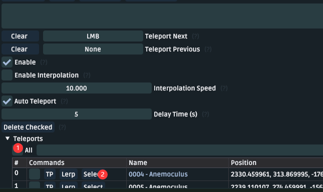

# How to use?

You should move the json file you need to the tools's "teleports" folder,

and click on "Reload" in "teleports"  menu,Then click on the red dot location in the image below

# Change GUI

**themes.rar** This is akebi-ui background 

You need unzip it and move it to the themes folder.

# Guide

## TeleportsALL_Old(2022/09/30)

Include all teleport.

**Note: Old files, incomplete **

> No Author,I don't konw who is the author.

If World is not "/",it means you needs teleport your role to the world.

## 1.Featuread

Dendroculus Folded

| AddTime    | Img                                               | Name/ID               | World                 | Author/ID     |
| ---------- | ------------------------------------------------- | --------------------- | --------------------- | ------------- |
| 2022/09/30 |            | AnemOculus            | Teyvat                | inkay#5122    |
| 2022/10/07 |        | Crimson Agate         | Teyvat                | 𝓜𝓪𝓻𝓽𝓲𝓷#6895   |
| 2022/09/30 |                | Geoculus              | Teyvat                | inkay#5122    |
| 2022/09/30 |        | Electroculus          | Teyvat                | inkay#5122    |
| 2022/10/11 |              | Lumenspar             | The Chasm Underground | emma1259#3965 |
| 2022/10/11 |              | Lumenspar-upgrade[^1] | The Chasm Underground | emma1259#3965 |
| 2022/09/30 |          | Dendroculus[^2]       | Teyvat                | inkay#5122    |
| 2022/10/05 |  | Sacred Seal           | Teyvat                | Misuki#9695   |

[^1]:  Lumenspar-upgrade is used by Lumenspar task upgrade.
[^2]:There are 3 subfolders in the folder of "Dendroculus", corresponding to its status in version 3.0 and version 3.1, and the summary of 2 versions

## 2.Animals

Because animal is always moving in your game, so you need change you setting.

For example,set your AutoLoot range bigger than before.

**P/S :Too big autoloot range is dangerous!!!**

| AddTime    | Img    | Name/ID         | World  | Author/ID       | NOTE                                                        |
| ---------- | ------ | --------------- | ------ | --------------- | ----------------------------------------------------------- |
| 2022/10/07 | 圣甲虫 | Teyvat scarab   | Teyvat | ShinaKaria#9760 | 72 pcs ,and you need set your autoloot range biger than 15m |
| 2022/10/12 | 圣甲虫 | Teyvat scarab#2 | Teyvat | civicmanan#2171 | 74 pcs, Automatically generate version                      |

## 3.Chunk

| AddTime    | Img                                         | Name/ID                            | World                 | Author/ID                        | NOTE                                                         |
| ---------- | ------------------------------------------- | ---------------------------------- | --------------------- | -------------------------------- | ------------------------------------------------------------ |
| 2022/10/11 |  | 72Enrichment points                | Teyvat                | jdbddbhd#9874                    | 72 mineral enrichment points, including Inazuma              |
| 2022/10/07 |  | CrystalChunk                       | Teyvat                | Michell Lim#9331 and Linxia#0961 | /                                                            |
| 2022/10/07 |  | CrystalChunk-The Chasm Underground | The Chasm Underground | Michell Lim#9331 and Linxia#0961 | CrystalChunk-19 to 43 is The Chasm Underground. You need manually tp into Chasm Underground 1st. |
| 2022/10/11 |  | EnkanomiyaAmethystLump             | Enkanomiya            | Michell Lim#9331                 | /                                                            |
| 2022/10/11 |  | AmethystLump                       | Teyvat                | Michell Lim#9331                 | /                                                            |
|            |                                             |                                    |                       |                                  |                                                              |
|            |                                             |                                    |                       |                                  |                                                              |
|            |                                             |                                    |                       |                                  |                                                              |

## 4.Plant

| AddTime    | Img                                                       | Name/ID             | World  | Author/ID       | NOTE                                                         |
| ---------- | --------------------------------------------------------- | ------------------- | ------ | --------------- | ------------------------------------------------------------ |
| 2022/10/10 |            | KalpalataLotus      | Teyvat | jdbddbhd#9874   | Total is 64+2+5.P/S:ID25 and ID26 you need pick by yourself,and 5 of all you need buy from npc. |
| 2022/10/12 |            | KalpalataLotus#2    | Teyvat | civicmanan#2171 | 66 pcs, Automatically generate version                       |
| 2022/10/11 |            | NilotpalaLotus      | Teyvat | jdbddbhd#9874   | ID47,55-57,you need pick them by yourself.                   |
| 2022/10/11 | 赤练果                                                    | Redcrest            | Teyvat | jdbddbhd#9874   | /                                                            |
| 2022/10/12 |  | RukkhashavaMushroom | Teyvat | civicmanan#2171 | 73 pcs, Automatically generate version                       |

## 5.Monster

| AddTime    | Img                                                 | Name/ID          | World  | Author/ID        | NOTE |
| ---------- | --------------------------------------------------- | ---------------- | ------ | ---------------- | ---- |
| 2022/10/11 |  | UnusualHilichurl | Teyvat | jdbddbhd#9874    | /    |
| 2022/10/11 |              | FatuiAgent       | Teyvat | Michell Lim#9331 | /    |

## Other

Only Chinese ,I don't know how to translate.

| AddTime    | Img           | Name/ID    | World  | Author/ID    | NOTE                                                         |
| ---------- | ------------- | ---------- | ------ | ------------ | ------------------------------------------------------------ |
| 2022/10/07 | artifact farm | gouliangv2 | Teyvat | 傻逼#7734    | 圣遗物狗粮(dogfood)，自动拾取5米                    P/S:作者ID确实叫这个，没有骂人的意思 |
| 2022/10/11 | 兰那罗        | 76Aranara  | Teyvat | Flowers#0948 | 76个兰那罗，这个不能全自动的奥，别搁这自动TP ，需要交材料 弹琴之类的，需要材料如下 |
